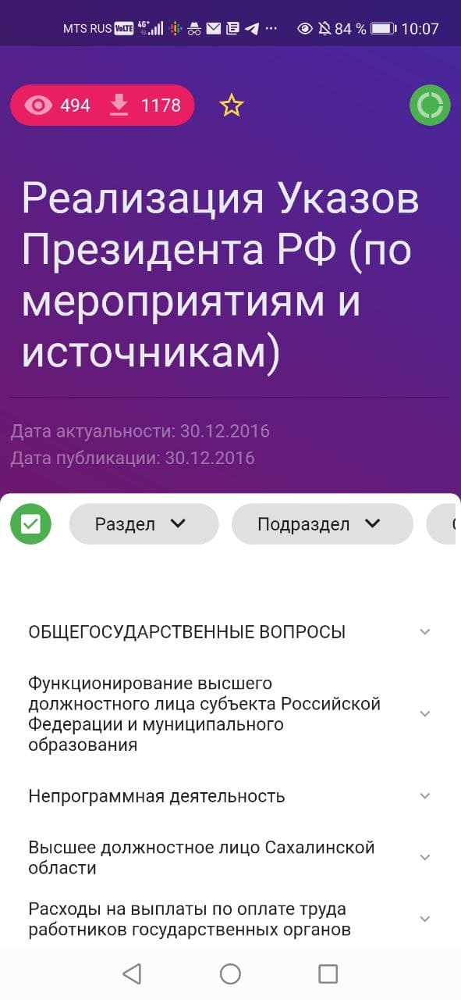
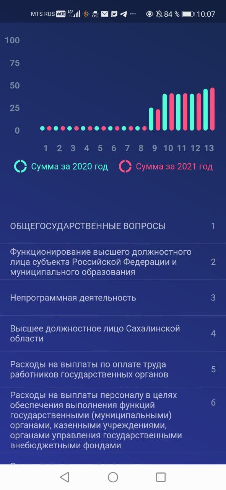

# Мобильное приложение open_data_sakhalin

## Описание
Приложение создано для участия в конкурсе BudgetApps 2020 Министерства финансов Сахалинской области. Приложение решает проблему - пользователю неудобно работать с наборами открытых данных на мобильном устройстве. Неудобство заключается в том, что:
1. Описание набора данных и сам набор дапнных хранятся в разных файлах
2. Работа с большим объемом данных ресурсоемкая операция для мобильного устройства и часто не хватает производительности
3. Набор данных можно только посмотреть, нельзя данные обработать, сравнить, построить график

## Технологический стек
Приложение написано на Flutter+Dart под Android.

## Скриншоты

  
  
  

  
  
  

## Видео с описанием работы

[Ссылка на Youtube](https://www.youtube.com/watch?v=w5m7scGxOx4)
